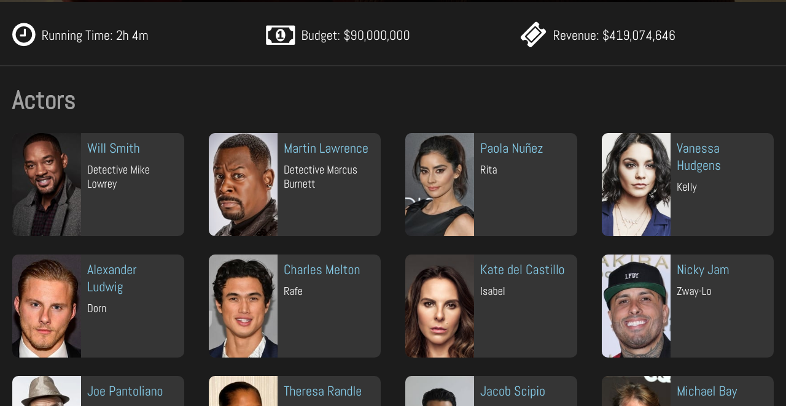

# Movie-App

## **<a href="https://oxydev.fr/movie-app/" target="_blank">Click here to demo</a>**

> A robustly featured and continuously developed React application, utilizing The Movie Database API to display movie data.

---

## Features

Browse movies by popularity, release date, or search. 

Save movies to a persistent favorites list for quick access any time.

View detailed movie information like runtimes, ratings, images, cast/crew data, and trailers.

---

## Libraries and Technologies

- Accesses The Movie Database (TMDb) API for movie related data
- Uses React, React Hooks
- Components, props and state
- Uses Axios for data fetching, included in a custom React Hook
- Uses React Router for routing
- Styled with Styled Components
- Use Local Storage and Session Storage to keep state
- Uses icons from Styled Icons (FontAwesome)

---

## Contact

> Reach out to me at:

- m27sylla@gmail.com

> My portfolio:

- <a href="https://oxydev.fr/portfolio/" target="_blank">https://oxydev.fr/portfolio/</a>

---

## Attribution

This application uses the TMDb API but is not endorsed or certified by TMDb.

---